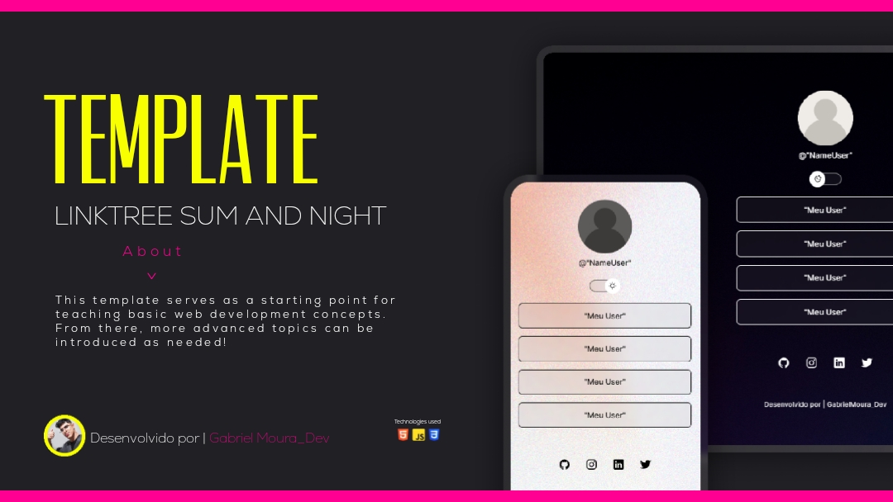

<h1 align="center"> Template-Linktree-Sun-and-Night  </h1>

Esse template serve como ponto de partida para ensinar conceitos básicos de desenvolvimento web. A partir dele, podem ser introduzidos tópicos mais avançados conforme necessário!

  <a href="#-tecnologias">Tecnologias</a>&nbsp;&nbsp;&nbsp;|&nbsp;&nbsp;&nbsp;
  <a href="#-projeto">Projeto</a>&nbsp;&nbsp;&nbsp;|&nbsp;&nbsp;&nbsp;
  <a href="#-layout">Layout</a>&nbsp;&nbsp;&nbsp;|&nbsp;&nbsp;&nbsp;

 

  

## 🚀 Tecnologias

Esse projeto foi desenvolvido com as seguintes tecnologias:

- HTML e CSS
- JavaScript
- Git e Github
- Figma

## 💻 Projeto

(Linktree-Sun-and-Night) é um agregador de links para usar como cartão de visitas online.

Developed by >Gabriel Moura_dev